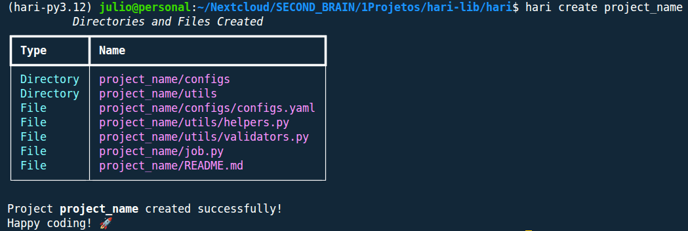
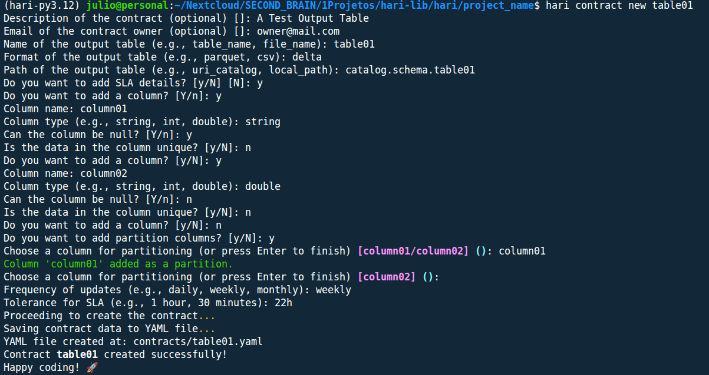

# Tutorial

If you've made it this far, it means you want to learn more about hari.

The goal of this project is to help beginner data engineers quickly adapt to the main tasks of data engineering such as extraction, transformation, validation, data quality, and data loading.

It can also be used by companies and experienced data engineers to automate repetitive tasks, create a development standard for teams, democratize the use of pyspark in your data platform, and increase the level of data maturity and governance through the use of the 'Data Contracts' concept, which is embedded in the library.



## Commands

`hari` distributes each function into a subcommand and you can execute each one to test now. The goal of this tutorial is to explain the basics of how the command line application works.

The subcommands of `hari cli` are divided into two functions so far: `create` and `contract`.

Let's understand what each one is intended to do.

### Create

The `create` subcommand helps us create a new pyspark project following a directory and file pattern that is very common in data projects.

The subcommand expects the project name to be passed (which will be the name of the project's root folder).

```bash
{{ commands.run }} create [PROJECT_NAME]
```

If everything goes well, you should see a message similar to the image below:

```bash
          Directories and Files Created          
┏━━━━━━━━━━━┳━━━━━━━━━━━━━━━━━━━━━━━━━━━━━━━━━━━┓
┃ Type      ┃ Name                              ┃
┡━━━━━━━━━━━╇━━━━━━━━━━━━━━━━━━━━━━━━━━━━━━━━━━━┩
│ Directory │ project_name/configs              │
│ Directory │ project_name/utils                │
│ File      │ project_name/configs/configs.yaml │
│ File      │ project_name/utils/helpers.py     │
│ File      │ project_name/utils/validators.py  │
│ File      │ project_name/job.py               │
│ File      │ project_name/README.md            │
└───────────┴───────────────────────────────────┘

Project project_name created successfully!
Happy coding! 🚀
```

An example of the output in the terminal:



### Contract

The `contract` subcommand is used for managing data contracts.

At the moment, the only available option is to create new contracts using the `new` parameter.

#### Creating a New Contract - Basic Usage

The creation of a new contract can be done using the `new` option, which expects the name of the contract to be created.

It is recommended to create contracts at least for the output tables of your project, and it is good practice for the contract name to be the same as the name of the table/file being saved.

!!! warning "About New Contracts"
    To create new contracts, you need to be inside the root folder of your project, otherwise the command will return an error.

See:

```bash
hari contract new [CONTRACT_NAME]
```

In your terminal, the CLI will ask several questions that will ultimately generate the data contract. They are:

```bash
Description of the contract (optional) []: A Test Output Table
Email of the contract owner (optional) []: owner@mail.com
Name of the output table (e.g., table_name, file_name): table01
Format of the output table (e.g., parquet, csv): delta
Path of the output table (e.g., uri_catalog, local_path): catalog.schema.table01
Do you want to add SLA details? [y/N] [N]: y
Do you want to add a column? [Y/n]: y
Column name: column01
Column type (e.g., string, int, double): string
Can the column be null? [Y/n]: y
Is the data in the column unique? [y/N]: n
Do you want to add a column? [y/N]: y
Column name: column02
Column type (e.g., string, int, double): double
Can the column be null? [Y/n]: n
Is the data in the column unique? [y/N]: n
Do you want to add a column? [y/N]: n
Do you want to add partition columns? [y/N]: y
Choose a column for partitioning (or press Enter to finish) [column01/column02] (): column01
Column 'column01' added as a partition.
Choose a column for partitioning (or press Enter to finish) [column02] (): 
Frequency of updates (e.g., daily, weekly, monthly): weekly
Tolerance for SLA (e.g., 1 hour, 30 minutes): 22h   
Proceeding to create the contract...
Saving contract data to YAML file...
YAML file created at: contracts/table01.yaml
Contract table01 created successfully!
Happy coding! 🚀
```

!!! warning "Optional Questions"
    Optional questions can be skipped by pressing the `enter` key.

An example of the output in the terminal:



#### Creating a New Contract - Available Parameters

It is possible to pass the following configurations directly when creating the contract:

| Parameter              | Description                                                      |
|------------------------|------------------------------------------------------------------|
| --output-table-name    | Name of the output table or file                                 |
| --output-table-format  | Format of the output table (e.g., csv, parquet, delta)           |
| --output-table-path    | Path or URI where the table/file will be saved                   |
| --sla                  | Indicates whether to add SLA details (y/n)                       |
| --description          | Description of the contract (optional)                           |
| --owner-email          | Email of the contract owner (optional)                           |

See an example:

```bash
hari contract new table02 \
    --output-table-name table02 \
    --output-table-format csv \
    --output-table-path local/path/to/table02.csv
```

If any of the parameters are not passed in the contract creation command, the question will appear next, along with the other questions we saw earlier. See:

```bash
Description of the contract (optional) []: 
Email of the contract owner (optional) []: 
Do you want to add SLA details? [y/N] [N]: y
Do you want to add a column? [Y/n]: y
Column name: Column04
Column type (e.g., string, int, double): string
Can the column be null? [Y/n]: y
Is the data in the column unique? [y/N]: n
Do you want to add a column? [y/N]: n
Do you want to add partition columns? [y/N]: n
Frequency of updates (e.g., daily, weekly, monthly): monthly
Tolerance for SLA (e.g., 1 hour, 30 minutes): 12:00   
Proceeding to create the contract...
Saving contract data to YAML file...
YAML file created at: contracts/table02.yaml
Contract table02 created successfully!
Happy coding! 🚀
```

## Learn More

Discover new ways to use `hari`:

```bash
hari [COMMAND] --help
```

## About this Tutorial

This tutorial was written on `2025-08-13`, commands may receive new updates. So checking `--help` is a good way to stay up to date.

If you found any errors in the tutorial or want to improve its text, feel free to contribute to the project at the link below.

[How to contribute to the project?](/02_contribute.html)