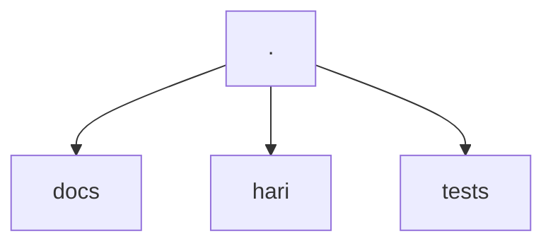
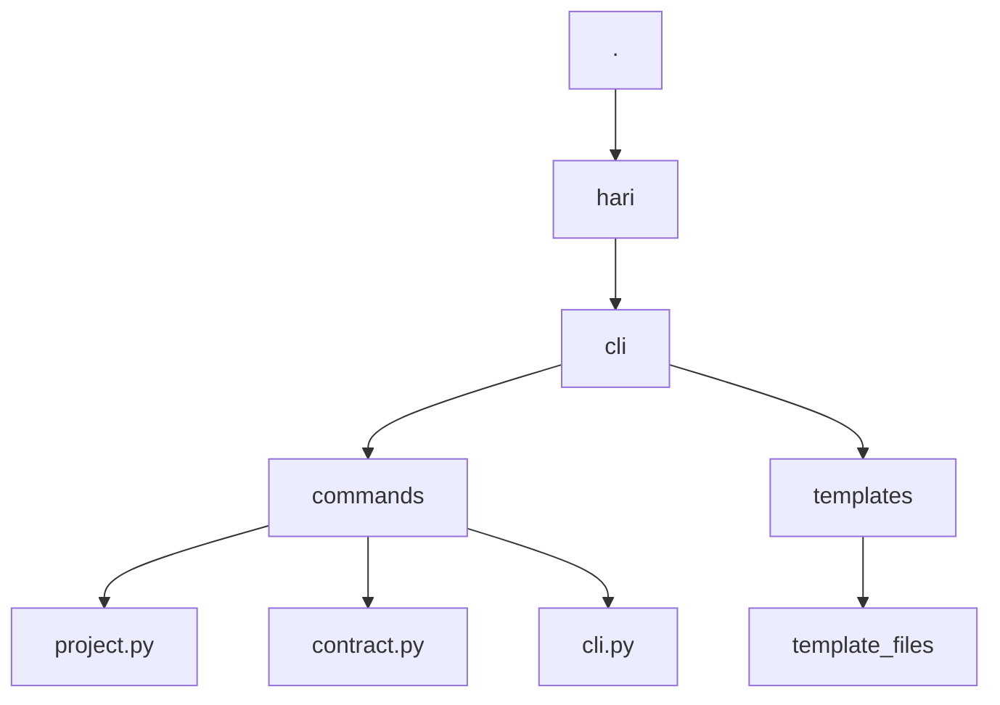
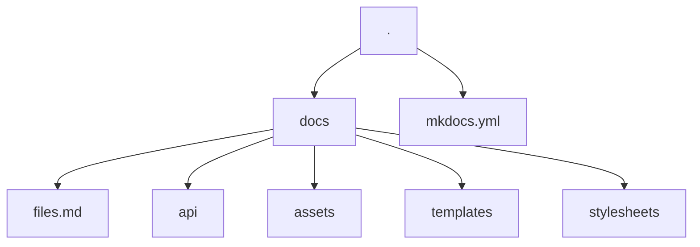

# Contribute

Thank you for your interest in contributing to the `hari` project :heart:. This document lists the most common operations you may need to contribute.

## How does the project work?

### Project Structure



The project is divided into three directories: `docs`, `hari`, and `tests`. Each directory has its specific function.

#### hari



The CLI code and the library are in `hari`. The API documentation is also being written in `hari`, using [mkdocstrings](https://mkdocstrings.github.io/) and following the [Google docstrings standard](https://sphinxcontrib-napoleon.readthedocs.io/en/latest/example_google.html). So, if you change anything in the code, remember to update the docstrings as well.

Some examples used in the docstrings are also used for tests. If you change the output format, remember to update the docstrings.

The `templates` directory contains base files for creating the project structure pattern. The `commands` directory contains the actual code that builds the CLI.

#### About the library

At this moment, the library uses pure Python, with no external dependencies. This is intentional, as the code is quite simple. Function responses are standardized to always return a Python dictionary, since someone may want to expand this to a graphical interface or use it in a REST API. Having a serializable standard can help a lot.

#### About data contracts

#### The CLI

The CLI was built using the [Typer](https://typer.tiangolo.com/) library. You can check its documentation for more details if you want to expand CLI functionalities.

For rich outputs in the application, the [Rich](https://rich.readthedocs.io/en/stable/introduction.html) library is used. If you want to change anything related to the tables generated in the output, you can go directly to the [documentation page](https://rich.readthedocs.io/en/stable/tables.html) for tables.

The only convention being followed regarding the CLI is that a `Console` object from Rich and a `Typer` app have already been defined. It would be best to continue using these objects.

```py title="hari/cli/commands/cli.py"
from rich.console import Console
from typer import Argument, Typer

...

console = Console()
app = Typer()
```

#### tests

For testing, we use [pytest](https://docs.pytest.org/). Its configuration can be found in the [pyproject.toml](https://github.com/julioszeferino/hari/blob/master/pyproject.toml) file at the root of the project.

Important things to know about the tests: not all tests are only in the `hari/tests` directory. The `addopts = "--doctest-modules"` flag is used. So, if you modify something, be aware that docstrings also run tests and are the basis for API documentation, so be careful with changes.

If you want to skip a test, just use the flag `# doctest: +SKIP`.

Test coverage is automatically generated with [pytest-cov](https://github.com/pytest-dev/pytest-cov) and is displayed when the test task is executed:

```bash
task tests
```

Linters are also required for these tests.

#### Documentation

All documentation is based on [mkdocs](https://www.mkdocs.org/) with the [mkdocs-material](https://squidfunk.github.io/mkdocs-material/) theme.



All configuration can be found in the [mkdocs.yml](https://github.com/dunossauro/notas-musicais/blob/main/mkdocs.yml) file at the root of the repository.

Various tools are also used to complement the documentation, such as [jinja](https://jinja.palletsprojects.com/en/3.1.x/) templates where instructions may repeat. If you find blocks like:

```html
{ %  % }
```

You will know it's a template.

Templates are defined in the `/docs/templates` directory. In some cases, however, they may be called by variables like `command.run`, which appears in almost every documentation file. These macros are made with [mkdocs-macros](https://mkdocs-macros-plugin.readthedocs.io/en/latest/) and are defined in the mkdocs configuration file:

```yaml
extra:
  commands:
    run: poetry run hari
```

##### API Documentation

API documentation is written inside the code modules. That's why files in the `docs/api` directory have a tag:

```md
::: module
```

This means the code contained in the docstrings will be used in this block. The [mkdocstrings](https://mkdocstrings.github.io/) plugin is used for this.

Documentation in the modules follows the [Google docstrings format](https://sphinxcontrib-napoleon.readthedocs.io/en/latest/example_google.html), which is the library standard.

## Tools

This project basically uses two main tools for all control:

- [Poetry](https://python-poetry.org/): For environment management and library installation
- [Taskipy](https://github.com/illBeRoy/taskipy): For automating routine tasks, such as running tests, linters, documentation, etc.

So, make sure you have poetry installed for your contribution:

```bash
pipx install poetry
```

## Steps to run specific tasks

Here are commands you can use to perform routine tasks, such as cloning the repository, installing dependencies, running tests, etc.

### How to clone the repository

```bash
git clone https://github.com/julioszeferino/hari.git
```

### How to install dependencies

```bash
poetry install
```

### How to run the CLI

```bash
poetry run hari [subcommand]
```

### How to run code checks

```bash
task lint
```

### How to run tests

```bash
task test
```

### How to run the documentation

```bash
task docs
```

## Tasks you can contribute to



## Didn't find what you need here?
If you didn't find what you need, you can open an [issue in the project](https://github.com/julioszeferino/hari/issues) describing what you can't do or what needs better documentation.

## Continuous improvement

This document can be improved by anyone interested in making it better. So, feel free to provide more tips for people who want to contribute as well :heart:

## Acknowledgements

A huge thank you to dear Eduardo Mendes([@dunossauro](https://github.com/dunossauro)) for taking the time to share with the community how to develop a Python library. His video inspired the development of this project.